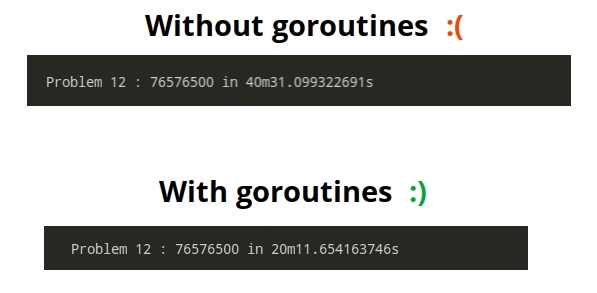
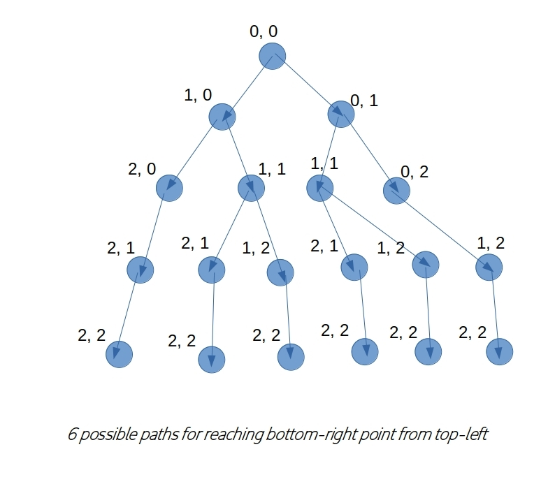
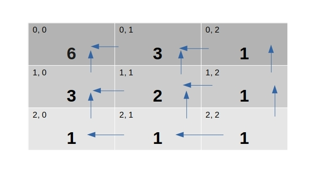

# project-euler
Another implementation of Project Euler Problems :wink: #ProjectEuler100

## motivation

I just came across one freecodecamp [post](https://www.freecodecamp.org/news/projecteuler100-coding-challenge-competitive-programming/), which tempted me to accept _#ProjectEuler100_ challenge. It's not like that prior to this I never thought of solving these beautiful mathematical problems, but I never opensourced it. So it's looks like a great opportunity to me, where I can challenge my thinking capability.

## solutions

I'm planning to stick to _GoLang_ as language of implementation. All solutions will stay in this [directory](./projecteuler/).

### [problem 1](./projecteuler/problem1.go)

#### statement

_If we list all the natural numbers below 10 that are multiples of 3 or 5, we get 3, 5, 6 and 9. The sum of these multiples is 23._

_Find the sum of all the multiples of 3 or 5 below 1000._

#### solution

233168 in 7.325µs

#### explanation

Iterating using a simple for loop _( starting from 3 )_, upto _(X -  1)_, where _X_ is given, and checking divisibility of current number by either 3 or 5. If it's divisible, then we add it up to _sum_ variable. And finally return _sum_, holding expected output.

### [problem 2](./projecteuler/problem2.go)

#### statement

_Each new term in the Fibonacci sequence is generated by adding the previous two terms. By starting with 1 and 2, the first 10 terms will be:_

_1, 2, 3, 5, 8, 13, 21, 34, 55, 89, ..._

_By considering the terms in the Fibonacci sequence whose values do not exceed four million, find the sum of the even-valued terms._

#### solution

4613732 in 2.752µs

#### explanation

Using dynamic programming style, for calculating fibonacci terms, recursive strategy will be straightforward but run slow ( and no doubt very expensive ). Starting with a slice of two elements `{1, 2}`, we'll keep calculating next fibonacci term until most recently computed term crosses _4,000,000_. And in each iteration, it'll check whether this term is even or not. If even, we'll add it up to _sum_ variable, which is initialized with _2_ ( because at very beginning _fibArr_, was only holding _2_ as even number )

### [problem 3](./projecteuler/problem3.go)

#### statement

_The prime factors of 13195 are 5, 7, 13 and 29._

_What is the largest prime factor of the number 600851475143 ?_

#### solution

6857 in 171.188338ms

#### explanation

First calculates square root of given number, and find out all primes which are under or equals to that sqrt value. Now we'll simply iterate over that prime holder slice, from last to first, i.e. from higher value prime to lower value prime, cause finally, we need to find out maximum prime factor of _num_. That'll allow us to perform lesser number of checkings.

Generation of primes under _X_, is done using dynamic programming strategy, by updating a slice holding primes, on runtime. Because we know any composite number must have prime factor, lesser than square root of that number. So we'll perform check with prime numbers only, which will save a lot of computation too.

### [problem 4](./projecteuler/problem4.go)

#### statement

_A palindromic number reads the same both ways. The largest palindrome made from the product of two 2-digit numbers is 9009 = 91 × 99._

_Find the largest palindrome made from the product of two 3-digit numbers._

#### solution

906609 in 172.4µs

#### explanation

We'll start from end i.e. for finding largest possible palindrome number under _1000_, we'll start checking from _999_ & keep multiplying two numbers _( < 1000 )_, until I reach _1_. But that'll be brute-force, which is why we'd prefer breaking out of current iteration, as soon as current product _( product in this iteration )_ goes below `largestPalim` _( which is largest palindrome computed upto this point )_.

### [problem 5](./projecteuler/problem5.go)

#### statement

_2520 is the smallest number that can be divided by each of the numbers from 1 to 10 without any remainder._

_What is the smallest positive number that is evenly divisible by all of the numbers from 1 to 20?_

#### solution

232792560 in 1.664408611s

#### explanation

We'll start finding smallest number divisible by all numbers from _1_ to _20_, at 10, because for any number to be divisible by _10_, it must end with round figure. And keep incrementing number under lens by _10_ ( after each iteration ), which will eventually reduce #-of computational steps required for finding result.

### [problem 6](./projecteuler/problem6.go)

#### statement

_The sum of the squares of the first ten natural numbers is, 12 + 22 + ... + 102 = 385_

_The square of the sum of the first ten natural numbers is,(1 + 2 + ... + 10)2 = 552 = 3025_

_Hence the difference between the sum of the squares of the first ten natural numbers and the square of the sum is 3025 − 385 = 2640._

_Find the difference between the sum of the squares of the first one hundred natural numbers and the square of the sum._

#### solution

25164150 in 275ns

#### explanation

We'll calculate square of sum of {1..100} ( used _n*(n+1)/2_, for finding sum of first _n_ natural numbers ) & square of each natural number {1..100}, while accumulating them up in a single variable. Finally a simple absolute substraction of those two, will get us desired result.

### [problem 7](./projecteuler/problem7.go)

#### statement

_By listing the first six prime numbers: 2, 3, 5, 7, 11, and 13, we can see that the 6th prime is 13._

_What is the 10,001st prime number?_

#### solution

104743 in 14.523821ms

#### explanation

We'll buffer all primes calculated uptil now, and check a certain odd number's _( for reducing number of steps, we're skipping even numbers, cause they are definitely composite )_ divisibility using primes _( buffered )_ under square root of `num`. Finally we return _(x-1)_ indexed term from buffer.

### [problem 8](./projecteuler/problem8.go)

#### statement

_The four adjacent digits in the 1000-digit number that have the greatest product are 9 × 9 × 8 × 9 = 5832._

_73167176531330624919225119674426574742355349194934_
_96983520312774506326239578318016984801869478851843_
_85861560789112949495459501737958331952853208805511_
_12540698747158523863050715693290963295227443043557_
_66896648950445244523161731856403098711121722383113_
_62229893423380308135336276614282806444486645238749_
_30358907296290491560440772390713810515859307960866_
_70172427121883998797908792274921901699720888093776_
_65727333001053367881220235421809751254540594752243_
_52584907711670556013604839586446706324415722155397_
_53697817977846174064955149290862569321978468622482_
_83972241375657056057490261407972968652414535100474_
_82166370484403199890008895243450658541227588666881_
_16427171479924442928230863465674813919123162824586_
_17866458359124566529476545682848912883142607690042_
_24219022671055626321111109370544217506941658960408_
_07198403850962455444362981230987879927244284909188_
_84580156166097919133875499200524063689912560717606_
_05886116467109405077541002256983155200055935729725_
_71636269561882670428252483600823257530420752963450_

_Find the thirteen adjacent digits in the 1000-digit number that have the greatest product. What is the value of this product?_

#### solution

23514624000 in 36.693µs

#### explanation

Given a _1000_ digit number _( as a string )_, we'll iterate over all indices of this string _( from 0 to 999 )_, so that we can consider all possible consequtive substrings of fixed length. Then we keep multiplying all digits present in each sub-sequence and take max of it. That'll satisfy our need, but multiplication of digits in subsequences is overlapping problem. So, we won't recompute, but use previous iterations cached value _( with care )_, if and only if it's not initial iteration & first digit of previous subsequence isn't _0_.

### [problem 9](./projecteuler/problem9.go)

#### statement

_A Pythagorean triplet is a set of three natural numbers, a < b < c, for which,_
_a^2 + b^2 = c^2_

_For example, 32 + 42 = 9 + 16 = 25 = 52._

_There exists exactly one Pythagorean triplet for which a + b + c = 1000._
_Find the product abc._

#### solution

31875000 in 145.78477ms

#### explanation

We start iterating from c=999 ( outer loop ), b=998 ( mid loop ), a=997 ( inner most loop ), satisfying a < b < c always. Now we need to check whether a+b+c == 1000 or not, if it's lesser than so, we need to break out of loop, avoiding unnecessary computation. If previous condition and Pythagorean Triplet condition is met, we calculate product of a, b, c, which is our desired result.

### [problem 10](./projecteuler/problem10.go)

#### statement

_The sum of the primes below 10 is 2 + 3 + 5 + 7 = 17._

_Find the sum of all the primes below two million._

#### solution

142913828922 in 585.534206ms

#### explanation

First we'll start generating all primes under given number _X_, and then simply summing them up, will get us our desired result. For generating primes, we're going to make use of one method _( GeneratePrimesUnderX )_ written during solving _Problem 3_.

### [problem 11](./projecteuler/problem11.go)

#### statement

_In the 20×20 grid below, four numbers along a diagonal line have been marked in red._

[ 08 02 22 97 38 15 00 40 00 75 04 05 07 78 52 12 50 77 91 08

49 49 99 40 17 81 18 57 60 87 17 40 98 43 69 48 04 56 62 00

81 49 31 73 55 79 14 29 93 71 40 67 53 88 30 03 49 13 36 65

52 70 95 23 04 60 11 42 69 24 68 56 01 32 56 71 37 02 36 91

22 31 16 71 51 67 63 89 41 92 36 54 22 40 40 28 66 33 13 80

24 47 32 60 99 03 45 02 44 75 33 53 78 36 84 20 35 17 12 50

32 98 81 28 64 23 67 10 26 38 40 67 59 54 70 66 18 38 64 70

67 26 20 68 02 62 12 20 95 63 94 39 63 08 40 91 66 49 94 21

24 55 58 05 66 73 99 26 97 17 78 78 96 83 14 88 34 89 63 72

21 36 23 09 75 00 76 44 20 45 35 14 00 61 33 97 34 31 33 95

78 17 53 28 22 75 31 67 15 94 03 80 04 62 16 14 09 53 56 92

16 39 05 42 96 35 31 47 55 58 88 24 00 17 54 24 36 29 85 57

86 56 00 48 35 71 89 07 05 44 44 37 44 60 21 58 51 54 17 58

19 80 81 68 05 94 47 69 28 73 92 13 86 52 17 77 04 89 55 40

04 52 08 83 97 35 99 16 07 97 57 32 16 26 26 79 33 27 98 66

88 36 68 87 57 62 20 72 03 46 33 67 46 55 12 32 63 93 53 69

04 42 16 73 38 25 39 11 24 94 72 18 08 46 29 32 40 62 76 36

20 69 36 41 72 30 23 88 34 62 99 69 82 67 59 85 74 04 36 16

20 73 35 29 78 31 90 01 74 31 49 71 48 86 81 16 23 57 05 54

01 70 54 71 83 51 54 69 16 92 33 48 61 43 52 01 89 19 67 48 ]

_The product of these numbers is 26 × 63 × 78 × 14 = 1788696._

_What is the greatest product of four adjacent numbers in the same direction (up, down, left, right, or diagonally) in the 20×20 grid?_

#### solution

70600674 in 776.735µs

#### explanation

First we go for exploring neighboring element sequences, for any given index in GRID. Now any index can have 8 directions _( at max )_ from it, i.e.

- left
- right
- top
- down
- top-left
- top-right
- bottom-left
- bottom-right

, given that a certain index which is calculated to be present in neighbor _( along any possible direction )_, is valid, otherwise we don't explore elements along that direction. How many elements to be considered as neighbor, will be specified _( here it's 4 )_. Now we'll simply calculate product of neighboring elements, and get max one for all indices. So, currently we're left with, 400 _( 20x20 GRID, so 400 cells )_, products, all we've to do, is to pick up max number from that list, which is our desired result.

### [problem 12](./projecteuler/problem12.go)

#### statement

_The sequence of triangle numbers is generated by adding the natural numbers. So the 7th triangle number would be 1 + 2 + 3 + 4 + 5 + 6 + 7 = 28. The first ten terms would be:_

_1, 3, 6, 10, 15, 21, 28, 36, 45, 55, ..._

_Let us list the factors of the first seven triangle numbers:_

     1: 1
     3: 1,3
     6: 1,2,3,6
    10: 1,2,5,10
    15: 1,3,5,15
    21: 1,3,7,21
    28: 1,2,4,7,14,28

_We can see that 28 is the first triangle number to have over five divisors._

_What is the value of the first triangle number to have over five hundred divisors?_

#### solution



#### explanation

This problem is pretty straightforward, all we've to do, is to keep generating triangular numbers, until we find one, which possesses factors _>= 500_. But if we plan to solve this problem deploying only one worker thread, it'll take a lot of time. So we're going to explore go-routines _( leveraging power of modern multi-core CPU architectures )_, that's why this implementation is a bit lengthy. Multi-threaded _( green threads )_ implementation details can be explored in source [code](./projecteuler/problem12.go).

### [problem 13](./projecteuler/problem13.go)

#### statement

_Work out the first ten digits of the sum of the following one-hundred 50-digit numbers._

37107287533902102798797998220837590246510135740250
46376937677490009712648124896970078050417018260538
74324986199524741059474233309513058123726617309629
91942213363574161572522430563301811072406154908250
23067588207539346171171980310421047513778063246676
89261670696623633820136378418383684178734361726757
28112879812849979408065481931592621691275889832738
44274228917432520321923589422876796487670272189318
47451445736001306439091167216856844588711603153276
70386486105843025439939619828917593665686757934951
62176457141856560629502157223196586755079324193331
64906352462741904929101432445813822663347944758178
92575867718337217661963751590579239728245598838407
58203565325359399008402633568948830189458628227828
80181199384826282014278194139940567587151170094390
35398664372827112653829987240784473053190104293586
86515506006295864861532075273371959191420517255829
71693888707715466499115593487603532921714970056938
54370070576826684624621495650076471787294438377604
53282654108756828443191190634694037855217779295145
36123272525000296071075082563815656710885258350721
45876576172410976447339110607218265236877223636045
17423706905851860660448207621209813287860733969412
81142660418086830619328460811191061556940512689692
51934325451728388641918047049293215058642563049483
62467221648435076201727918039944693004732956340691
15732444386908125794514089057706229429197107928209
55037687525678773091862540744969844508330393682126
18336384825330154686196124348767681297534375946515
80386287592878490201521685554828717201219257766954
78182833757993103614740356856449095527097864797581
16726320100436897842553539920931837441497806860984
48403098129077791799088218795327364475675590848030
87086987551392711854517078544161852424320693150332
59959406895756536782107074926966537676326235447210
69793950679652694742597709739166693763042633987085
41052684708299085211399427365734116182760315001271
65378607361501080857009149939512557028198746004375
35829035317434717326932123578154982629742552737307
94953759765105305946966067683156574377167401875275
88902802571733229619176668713819931811048770190271
25267680276078003013678680992525463401061632866526
36270218540497705585629946580636237993140746255962
24074486908231174977792365466257246923322810917141
91430288197103288597806669760892938638285025333403
34413065578016127815921815005561868836468420090470
23053081172816430487623791969842487255036638784583
11487696932154902810424020138335124462181441773470
63783299490636259666498587618221225225512486764533
67720186971698544312419572409913959008952310058822
95548255300263520781532296796249481641953868218774
76085327132285723110424803456124867697064507995236
37774242535411291684276865538926205024910326572967
23701913275725675285653248258265463092207058596522
29798860272258331913126375147341994889534765745501
18495701454879288984856827726077713721403798879715
38298203783031473527721580348144513491373226651381
34829543829199918180278916522431027392251122869539
40957953066405232632538044100059654939159879593635
29746152185502371307642255121183693803580388584903
41698116222072977186158236678424689157993532961922
62467957194401269043877107275048102390895523597457
23189706772547915061505504953922979530901129967519
86188088225875314529584099251203829009407770775672
11306739708304724483816533873502340845647058077308
82959174767140363198008187129011875491310547126581
97623331044818386269515456334926366572897563400500
42846280183517070527831839425882145521227251250327
55121603546981200581762165212827652751691296897789
32238195734329339946437501907836945765883352399886
75506164965184775180738168837861091527357929701337
62177842752192623401942399639168044983993173312731
32924185707147349566916674687634660915035914677504
99518671430235219628894890102423325116913619626622
73267460800591547471830798392868535206946944540724
76841822524674417161514036427982273348055556214818
97142617910342598647204516893989422179826088076852
87783646182799346313767754307809363333018982642090
10848802521674670883215120185883543223812876952786
71329612474782464538636993009049310363619763878039
62184073572399794223406235393808339651327408011116
66627891981488087797941876876144230030984490851411
60661826293682836764744779239180335110989069790714
85786944089552990653640447425576083659976645795096
66024396409905389607120198219976047599490197230297
64913982680032973156037120041377903785566085089252
16730939319872750275468906903707539413042652315011
94809377245048795150954100921645863754710598436791
78639167021187492431995700641917969777599028300699
15368713711936614952811305876380278410754449733078
40789923115535562561142322423255033685442488917353
44889911501440648020369068063960672322193204149535
41503128880339536053299340368006977710650566631954
81234880673210146739058568557934581403627822703280
82616570773948327592232845941706525094512325230608
22918802058777319719839450180888072429661980811197
77158542502016545090413245809786882778948721859617
72107838435069186155435662884062257473692284509516
20849603980134001723930671666823555245252804609722
53503534226472524250874054075591789781264330331690

#### solution

5537376230 in 173.641µs

#### explanation

For handling arbitrary precision numbers, Golang provides us with "math/big" package, which is pretty handy in manipulating big numbers. After summing these 100 big numbers, we'll simply convert it to string, so that slicing first 10 digits become easier.

### [problem 14](./projecteuler/problem14.go)

#### statement

_The following iterative sequence is defined for the set of positive integers:_

_n → n/2 (n is even)_
_n → 3n + 1 (n is odd)_

_Using the rule above and starting with 13, we generate the following sequence:_

_13 → 40 → 20 → 10 → 5 → 16 → 8 → 4 → 2 → 1_

_It can be seen that this sequence (starting at 13 and finishing at 1) contains 10 terms. Although it has not been proved yet (Collatz Problem), it is thought that all starting numbers finish at 1._

_Which starting number, under one million, produces the longest chain ?_

_NOTE: Once the chain starts the terms are allowed to go above one million._

#### solution

837799 in 1.345537614s

#### explanation

For finding longest collatz sequence, generated by which number under _10^6_, we're going to deploy _10^6_ number of light-weight go-routines, for sake of faster computation. Next term of collatz sequence is generated by following rule

```golang
if n%2 == 0 {
	return n / 2
}
return 3*n + 1
```

We need to keep computing until we reach 1 _( because it's thought that all collatz sequences end at 1 )_.

### [problem 15](./projecteuler/problem15.go)

#### statement

_Starting in the top left corner of a 2×2 grid, and only being able to move to the right and down, there are exactly 6 routes to the bottom right corner._

_How many such routes are there through a 20×20 grid?_

#### solution

137846528820 in 22m41.809635403s _( **using Recursion** )_

137846528820 in 4.076µs _( **using Bottom-Up approach i.e. Dynamic Programming** )_

#### explanation

Recursively computes possible number of paths for reaching bottom-right cell, while starting at top-left cell (0, 0). We can think of it like we're splitting into two child _( at max )_ routes at every vertex, until we get to target vertex _(2, 2)_ for example case.



**Improvement** - We can probably understand this problem is having following two properties

- Optimal Substructure
- Overlapping Subproblems

which are enough to indicate that this one can be solved using Dynamic Programming. So we're going to use a two dimentional array to store number of possible paths which can be taken from a certain index _(i, j)_, to reach bottom-right most index _(20, 20)_.



### [problem 16](./projecteuler/problem16.go)

#### statement

_2^15 = 32768 and the sum of its digits is 3 + 2 + 7 + 6 + 8 = 26._

_What is the sum of the digits of the number 2^1000?_

#### solution

1366 in 20.087µs

#### explanation

Calculates sum of digits of _base ^ pow_, using `math/big` package of go standard library.

**More coming soon ...** :wink:
